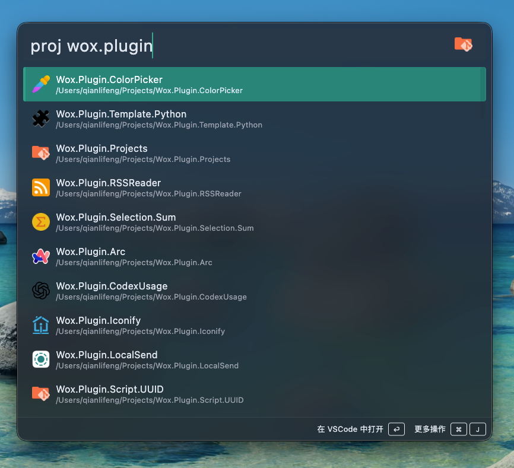

# Wox.Plugin.Projects

A Wox plugin to quickly access your Git projects. It scans specified directories for Git repositories and allows you to open them in your terminal or file explorer.



# Install

```
wpm install Projects
```
